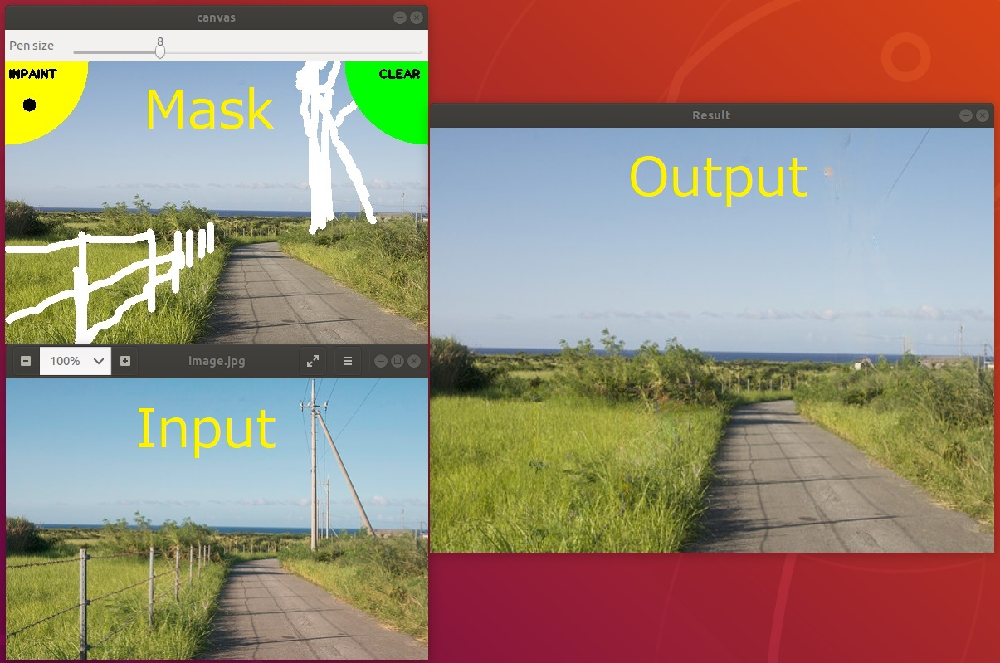

# Interactive Image Inpainting Demo
This program demonstrates how the `inpainting-gmcnn` model works with the [Intel(r) Distribution of OpenVINO(tm) toolkit](https://software.intel.com/en-us/openvino-toolkit).  
The demo program takes an image file and display it on the screen. User can draw the mask image on top of the input image, then the program will treat the masked areas are lacking and inpaint (compensate) the image by deep learning based inferencing.  
You can remove undesired objects from your picture by masking them and the program will generate a natural looking picture without the undesired objects.  

これは[Intel(r) Distribution of OpenVINO(tm) toolkit](https://software.intel.com/en-us/openvino-toolkit)で`inpainting-gmcnn` (画像修復モデル)を使用する方法をデモするプログラムです。  
デモプログラムは画像を１枚読み込み、表示します。ユーザーが入力画像の上に自由にマスクを描画したのち、プログラムがマスク部分を欠損部分として扱い、欠損部分を補うようにディープラーニングでの推論を行い自動描画(Inpaint)してくれます。  
絵の中の望ましくない部分(景色に写りこんだ柵や人など)をマスクすることで、それらを取り除いた自然な絵を生成してくれます（当然ですが限度があります:-) ）。  


### Image Inpainting Result



### Required DL Models to Run This Demo

The demo expects the following models in the Intermediate Representation (IR) format:

  * `gmcnn-place2-tf`

You can download this model from OpenVINO [Open Model Zoo](https://github.com/opencv/open_model_zoo).
In the `models.lst` is the list of appropriate models for this demo that can be obtained via `Model downloader`.
Please see more information about `Model downloader` [here](../../../tools/downloader/README.md).

## How to Run


### 0. Prerequisites
- **OpenVINO 2020.2**
  - If you haven't installed it, go to the OpenVINO web page and follow the [*Get Started*](https://software.intel.com/en-us/openvino-toolkit/documentation/get-started) guide to do it.  


### 1. Install dependencies  
The demo depends on:
- `opencv-python`
- `numpy`

To install all the required Python modules you can use:

``` sh
(Linux) pip3 install -r requirements.txt
(Win10) pip install -r requirements.txt
```

### 2. Download DL models from OMZ
Use `Model Downloader` to download the required models and convert the downloaded model into OpenVINO IR models with `Model Converter`.  
``` sh
(Linux) python3 $INTEL_OPENVINO_DIR/deployment_tools/tools/model_downloader/downloader.py --list models.lst
        python3 $INTEL_OPENVINO_DIR/deployment_tools/tools/model_downloader/converter.py --list models.lst
       
(Win10) python "%INTEL_OPENVINO_DIR%\deployment_tools\tools\model_downloader\downloader.py" --list models.lst
        python "%INTEL_OPENVINO_DIR%\deployment_tools\tools\model_downloader\converter.py" --list models.lst
```

### 3. Run the demo app

``` sh
(Linux) python3 image-inpainting.py <input_image_file>
(Win10) python image-inpainting.py <input_image_file>
```

## Demo Output  
The application draws the results on the screen.

## Tested Environment  
- Windows 10 x64 1909 and Ubuntu 18.04 LTS  
- Intel(r) Distribution of OpenVINO(tm) toolkit 2020.2  
- Python 3.6.5 x64  

## See Also  
* [Using Open Model Zoo demos](../../README.md)  
* [Model Optimizer](https://docs.openvinotoolkit.org/latest/_docs_MO_DG_Deep_Learning_Model_Optimizer_DevGuide.html)  
* [Model Downloader](../../../tools/downloader/README.md)  
